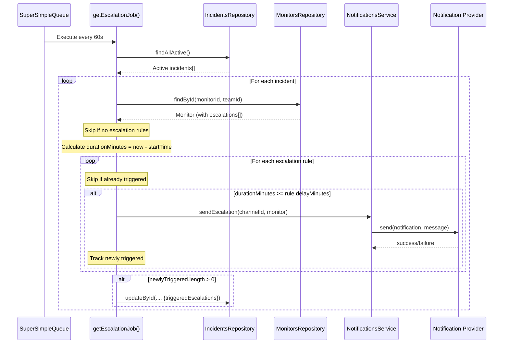

# Notification Escalations (1D) — Implementation Review

## Summary

> [!IMPORTANT]
> The entire Notification Escalations feature **exists exclusively in the git worktree** at `e:\Checkmate\Checkmate\.worktrees\feat-notification-escalations\` and has **NOT been merged** into the main working directory at `e:\Checkmate\Checkmate\`. The main branch contains zero escalation-related code.

Within the worktree branch, **all listed components are properly implemented**. Below is the full audit.

---

## Backend (Server) — All ✅

### 1. `types/monitor.ts` — ✅ Properly Implemented
[monitor.ts](file:///e:/Checkmate/Checkmate/.worktrees/feat-notification-escalations/server/src/types/monitor.ts#L18-L21)

```typescript
export interface MonitorEscalation {
    delayMinutes: number;
    channelId: string; // references a Notification._id
}
```

- `MonitorEscalation` interface defined at lines 18–21
- `escalations?: MonitorEscalation[]` field added to `Monitor` interface at line 45

---

### 2. `types/incident.ts` — ✅ Properly Implemented
[incident.ts](file:///e:/Checkmate/Checkmate/.worktrees/feat-notification-escalations/server/src/types/incident.ts#L19)

```typescript
triggeredEscalations?: string[];
```

- `triggeredEscalations?` optional `string[]` field added to `Incident` interface at line 19

---

### 3. `db/models/Monitor.ts` — ✅ Properly Implemented
[Monitor.ts](file:///e:/Checkmate/Checkmate/.worktrees/feat-notification-escalations/server/src/db/models/Monitor.ts#L177-L183)

```typescript
const escalationSchema = new Schema<{ delayMinutes: number; channelId: Types.ObjectId }>({
    delayMinutes: { type: Number, required: true },
    channelId: { type: Schema.Types.ObjectId, ref: "Notification", required: true },
}, { _id: false });
```

- `escalationSchema` sub-document at lines 177–183 with `_id: false`
- `channelId` is an `ObjectId` referencing `Notification`
- `MonitorDocumentBase` includes `escalations` at line 28
- Schema field at lines 367–370 with `default: []`

---

### 4. `db/models/Incident.ts` — ✅ Properly Implemented
[Incident.ts](file:///e:/Checkmate/Checkmate/.worktrees/feat-notification-escalations/server/src/db/models/Incident.ts#L76-L79)

```typescript
triggeredEscalations: {
    type: [String],
    default: [],
},
```

- `IncidentDocumentBase` includes `triggeredEscalations: string[]` at line 12
- Schema field at lines 76–79 with `type: [String]` and `default: []`

---

### 5. `repositories/incidents/` — ✅ Properly Implemented

#### Interface: [IIncidentsRepository.ts](file:///e:/Checkmate/Checkmate/.worktrees/feat-notification-escalations/server/src/repositories/incidents/IIncidentsRepository.ts#L10)
```typescript
findAllActive(): Promise<Incident[]>;
```

#### Mongo Implementation: [MongoIncidentsRepository.ts](file:///e:/Checkmate/Checkmate/.worktrees/feat-notification-escalations/server/src/repositories/incidents/MongoIncidentsRepository.ts#L119-L122)
```typescript
findAllActive = async (): Promise<Incident[]> => {
    const incidents = await IncidentModel.find({ status: true });
    return this.mapDocuments(incidents);
};
```
- `toEntity` maps `triggeredEscalations` at line 65

#### Timescale Implementation: [TimescaleIncidentsRepository.ts](file:///e:/Checkmate/Checkmate/.worktrees/feat-notification-escalations/server/src/repositories/incidents/TimescaleIncidentsRepository.ts#L74-L77)
```typescript
findAllActive = async (): Promise<Incident[]> => {
    const result = await this.pool.query<IncidentRow>(`SELECT ${COLUMNS} FROM incidents WHERE status = TRUE`);
    return result.rows.map((row) => this.toEntity(row));
};
```
- Fully implemented — queries all active incidents
- `IncidentRow` includes `triggered_escalations: string[] | null` at line 21
- `COLUMNS` include `triggered_escalations` at line 25
- `toEntity` maps `triggeredEscalations` at line 299
- `updateById` includes `triggeredEscalations` in its `fieldMap` at line 216

---

### 6. `notificationsService.ts` — ✅ Properly Implemented
[notificationsService.ts](file:///e:/Checkmate/Checkmate/.worktrees/feat-notification-escalations/server/src/service/infrastructure/notificationsService.ts#L17)

**Interface** (line 17):
```typescript
sendEscalation: (channelId: string, monitor: Monitor) => Promise<boolean>;
```

**Implementation** (lines 150–201):
- Looks up notification channel by ID
- Constructs a `NotificationMessage` with:
  - `type: "monitor_down"`, `severity: "critical"`
  - Title: `Escalation: ${monitor.name}`
  - Metadata: `notificationReason: "escalation"`
- Routes through existing `send()` method (which supports all provider types)
- Has error handling with logging

---

### 7. `SuperSimpleQueueHelper.ts` — ✅ Properly Implemented
[SuperSimpleQueueHelper.ts](file:///e:/Checkmate/Checkmate/.worktrees/feat-notification-escalations/server/src/service/infrastructure/SuperSimpleQueue/SuperSimpleQueueHelper.ts#L33)

**Interface** (line 33):
```typescript
getEscalationJob(): () => Promise<void>;
```

**Implementation** (lines 358–442):
The job:
1. Fetches all active incidents via `incidentsRepository.findAllActive()`
2. For each incident, calculates `durationMinutes` from `startTime`
3. Fetches the monitor via `monitorsRepository.findById()`
4. Skips monitors with no escalation rules
5. Reads `triggeredEscalations` from the incident
6. For each escalation rule where `durationMinutes >= rule.delayMinutes` and channel not already triggered:
   - Calls `notificationsService.sendEscalation(rule.channelId, monitor)`
   - Tracks newly triggered channels
7. Persists combined `triggeredEscalations` via `incidentsRepository.updateById()`
8. Comprehensive error handling with per-rule try/catch (non-fatal) and outer try/catch

---

### 8. `SuperSimpleQueue.ts` — ✅ Properly Implemented
[SuperSimpleQueue.ts](file:///e:/Checkmate/Checkmate/.worktrees/feat-notification-escalations/server/src/service/infrastructure/SuperSimpleQueue/SuperSimpleQueue.ts#L165)

**Template registration** (line 165):
```typescript
this.scheduler.addTemplate("escalation-check-job", this.helper.getEscalationJob());
```

**Job scheduling** (line 179):
```typescript
this.scheduler.addJob({ id: "escalation-check", template: "escalation-check-job", active: true, repeat: 60 * 1000 });
```
- Repeats every **60 seconds** = 1 minute

---

### 9. `validation/monitorValidation.ts` — ✅ Properly Implemented
[monitorValidation.ts](file:///e:/Checkmate/Checkmate/.worktrees/feat-notification-escalations/server/src/validation/monitorValidation.ts#L6-L9)

```typescript
const escalationRuleSchema = z.object({
    delayMinutes: z.number().int().min(1, "Delay must be at least 1 minute"),
    channelId: z.string().min(1, "Channel ID is required"),
});
```

Applied to all three schemas:

| Schema | Line | Modifier |
|--------|------|----------|
| `createMonitorBodyValidation` | 86 | `.optional()` |
| `editMonitorBodyValidation` | 116 | `.optional()` |
| `importedMonitorSchema` | 170 | `.default([])` |

---

## Frontend (Client) — All ✅

### 10. `Types/Monitor.ts` — ✅ Properly Implemented
[Monitor.ts](file:///e:/Checkmate/Checkmate/.worktrees/feat-notification-escalations/client/src/Types/Monitor.ts#L6-L9)

```typescript
export interface MonitorEscalation {
    delayMinutes: number;
    channelId: string;
}
```
- `escalations?: MonitorEscalation[]` at line 84

---

### 11. `Pages/CreateMonitor/index.tsx` — ✅ Properly Implemented
[index.tsx](file:///e:/Checkmate/Checkmate/.worktrees/feat-notification-escalations/client/src/Pages/CreateMonitor/index.tsx#L220-L261)

| Feature | Status | Lines |
|---------|--------|-------|
| Escalation state (`useState`) | ✅ | 220–223 |
| Edit-mode pre-population from `existingMonitor` | ✅ | 225–234 |
| `addEscalationRule()` | ✅ | 245–247 |
| `removeEscalationRule(originalIndex)` | ✅ | 249–251 |
| `updateEscalationRule(originalIndex, field, value)` | ✅ | 253–261 |
| Empty-rule filtering on submit | ✅ | 290–293 |
| Ascending sort by `delayMinutes` in render | ✅ | 812–814 |
| Per-row: delay input (`TextField type="number"`) | ✅ | 822–838 |
| Per-row: channel select (populated from `notifications`) | ✅ | 839–866 |
| Per-row: delete button (`IconButton` + `Trash2`) | ✅ | 867–875 |
| "Add Rule" button | ✅ | 882–888 |
| i18n: all strings use `t()` function | ✅ | Throughout |

---

### 12. Locale Files — ✅ All 16 Files Updated

All 16 locale files contain the escalation translation keys (3 occurrences each):

| File | Matches |
|------|---------|
| ar.json | 3 |
| cs.json | 3 |
| de.json | 3 |
| en.json | 3 |
| es.json | 3 |
| fi.json | 3 |
| fr.json | 3 |
| ja.json | 3 |
| pt-BR.json | 3 |
| ru.json | 3 |
| th.json | 3 |
| tr.json | 3 |
| uk.json | 3 |
| vi.json | 3 |
| zh-CN.json | 3 |
| zh-TW.json | 3 |

**English keys structure** (from `en.json` lines 626–642):
```json
"escalations": {
    "title": "Escalation Rules",
    "description": "Automatically notify a channel if an incident remains unresolved after a delay",
    "addRule": "Add Rule",
    "option": {
        "delayMinutes": { "label": "Escalate after (minutes)" },
        "channel": { "label": "Notification channel", "placeholder": "Select a channel" },
        "removeRule": { "ariaLabel": "Remove escalation rule" }
    }
}
```

---

## Architecture Flow



---

## Notable Design Decisions

1. **Re-fire prevention**: `triggeredEscalations` is persisted per-incident, preventing duplicate notifications on subsequent 60s sweeps.

2. **Non-fatal channel errors**: Individual escalation send failures are caught and logged but don't prevent other rules from firing.

3. **Sort on render, not on state**: Escalation rules are stored in insertion order but displayed sorted ascending by `delayMinutes`.

4. **Empty-rule filtering**: Rules with empty `channelId` or `delayMinutes < 1` are stripped before submission.

5. **Full Timescale support**: Both `findAllActive()` and `updateById` (with `triggeredEscalations` in `fieldMap`) are fully implemented for TimescaleDB.

---


